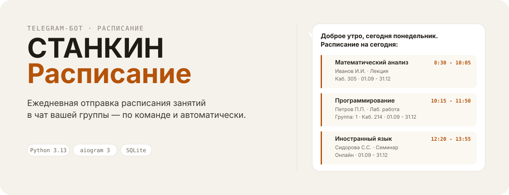

<p align="center">
  
</p>

<p align="center">
  <a href="https://github.com/overklassniy/stankin_schedule_bot/actions"></a>
  <a href="LICENSE"></a>
  <a href="https://www.python.org/downloads/"></a>
  <a href="https://github.com/aiogram/aiogram"></a>
  <a href="https://github.com/overklassniy/stankin_schedule_bot/issues"></a>
  <a href="https://github.com/overklassniy/stankin_schedule_bot/pulls"></a>
</p>

**СТАНКИН Расписание** — Telegram-бот на aiogram, который каждый день отправляет расписание занятий вашей группы в указанный чат. Работает по команде и по расписанию, поддерживает группы, супергруппы и топики.

- Ежедневная автоматическая отправка в заданное время
- Команды `/schedule` и `/tomorrow` — расписание на сегодня, завтра и по дате
- Источник расписания — PDF с Moodle (гостевой доступ, без токена)
- Кэш PDF и распарсенного расписания (TTL + сигнатура файла)
- Настройки через inline-кнопки: код группы, время, картинки, кнопка «Завтра»
- Хранение настроек групп в SQLite, поддержка нескольких чатов
- Запуск локально или в Docker

## Быстрый старт

1. **Клонируйте репозиторий**
   ```bash
   git clone https://github.com/overklassniy/stankin_schedule_bot.git
   cd stankin_schedule_bot
   ```

2. **Установите зависимости**
   ```bash
   pip install -r requirements.txt
   ```
   Для парсинга PDF также нужен Ghostscript — см. [Установка](docs/installation.md).

3. **Настройте окружение**
   ```bash
   cp .env.example .env
   ```
   Откройте `.env` и укажите `BOT_TOKEN`. Подробно — в [Конфигурации](docs/configuration.md).

4. **Запустите бота**
   ```bash
   python bot.py
   ```

5. **Добавьте бота в группу** — он привяжется автоматически. В группе выполните `/settings` и укажите код группы (например, `ИДБ-24-10`).

> Запуск через Docker описан в [Установке](docs/installation.md#docker).

## Команды

| Команда | Псевдоним | Описание |
| --- | --- | --- |
| `/schedule` | `/s` | Расписание на сегодня. Можно со смещением: `/s 1`, `/s 25.12` |
| `/tomorrow` | `/t` | Расписание на завтра |
| `/settings` | — | Настройки группы (код, время, картинки, кнопка «Завтра») — для админов |
| `/settopic` | — | Привязать расписание к текущему топику супергруппы |
| `/code` | — | Ссылка на исходный код бота |

Подробнее — в [Использовании](docs/usage.md).

## Как это работает

Бот скачивает PDF расписания с Moodle по коду группы, парсит таблицы через `camelot`, кэширует результат и отправляет сформированное HTML-сообщение в чат — по команде пользователя или по расписанию из настроек группы.

Подробнее об устройстве — в [Архитектуре](docs/architecture.md).

## Структура проекта

```
.
├── bot.py              # Точка входа: запуск polling и планировщика
├── config.py           # Статическая конфигурация из .env
├── handlers/           # Обработчики aiogram (команды, callback, привязка)
├── services/           # Moodle-клиент, планировщик, кэш расписания
├── db/                 # SQLite: схема и модели (группы, админы)
├── utils/              # Логирование и парсинг PDF
├── data/               # БД, кэш PDF, JSON с именами преподавателей
├── images/             # Изображения для отправки (если включено)
├── docs/               # Подробная документация
└── assets/readme/      # SVG-ассеты для README
```

## Технологии

- **[Python 3.13](https://www.python.org/)** — язык
- **[aiogram 3](https://github.com/aiogram/aiogram)** — асинхронный фреймворк для Telegram Bot API
- **[camelot-py](https://camelot-py.readthedocs.io/)** — извлечение таблиц из PDF
- **[aiosqlite](https://github.com/omnilib/aiosqlite)** — асинхронная работа с SQLite
- **[aiohttp](https://docs.aiohttp.org/)** — HTTP-клиент для Moodle и сессия бота

## Документация

- [Установка](docs/installation.md) — зависимости, Ghostscript, Docker
- [Конфигурация](docs/configuration.md) — `.env` и параметры
- [Использование](docs/usage.md) — команды и сценарии
- [Архитектура](docs/architecture.md) — устройство и поток данных

## Участие и сообщество

- [CONTRIBUTING.md](CONTRIBUTING.md) — как предлагать улучшения и присылать pull request
- [SECURITY.md](SECURITY.md) — как сообщать об уязвимостях
- [SUPPORT.md](SUPPORT.md) — где получить помощь
- [Шаблоны issues](.github/ISSUE_TEMPLATE/) — формы для баг-репортов, предложений и вопросов

## Лицензия

Проект распространяется под лицензией MIT. Подробности — в файле [LICENSE](LICENSE).
