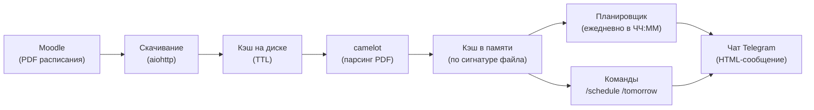

# Архитектура

## Обзор

Бот построен на aiogram 3 с одноуровневой пакетной структурой. Точка входа — `bot.py`: инициализация диспетчера, подключение роутеров, запуск планировщика и long polling.

## Поток данных

1. **Moodle-клиент** (`services/moodle_client.py`) — гостевой вход, поиск папок курса, скачивание PDF по имени файла, совпадающему с кодом группы.
2. **Кэш расписания** (`services/schedule_cache.py`) — гибридный кэш: PDF на диске с TTL и распарсенный результат в памяти. Инвалидация по сигнатуре файла (mtime + size). Блокировки предотвращают параллельное скачивание одного файла.
3. **Парсер** (`utils/parser.py`) — camelot извлекает таблицу из PDF, `fix_labs` объединяет строки лабораторных по подгруппам, `get_today_schedule` фильтрует пары по датам и периодам (с учётом «к.н.» / «ч.н.»).
4. **Планировщик** (`services/scheduler.py`) — фоновая задача, проверяет время и отправляет расписание подходящим группам. Защита от повторной отправки через множество `(group_id, date)`.
5. **Хендлеры** (`handlers/`) — команды и callback-запросы.

## Структура пакетов

### `bot.py`

Точка входа. Инициализирует БД (`init_db`), добавляет админов из `ADMIN_IDS`, создаёт `Bot` (с прокси при наличии), запускает `run_daily_scheduler` в фоновой задаче и начинает long polling.

### `config.py`

Статическая конфигурация. Читает переменные окружения при импорте. Хранит пути, дефолты для новых групп, настройки Moodle и кэша.

### `handlers/`

Обработчики aiogram-роутеров:

- `group_bind.py` — привязка/отвязка чата при добавлении/удалении бота (`my_chat_member`).
- `schedule.py` — команды `/schedule`, `/s`, `/tomorrow`, `/t` и callback «Завтра».
- `settings.py` — команда `/settings`, inline-кнопки настроек, FSM для ввода кода группы и времени.
- `code.py` — команда `/code` (ссылка на GitHub).
- `private.py` — приветствие в личных сообщениях.

### `services/`

Бизнес-логика и внешние интеграции:

- `moodle_client.py` — гостевой вход на Moodle, поиск PDF по коду группы, скачивание.
- `schedule_cache.py` — гибридный кэш PDF и распарсенного расписания.
- `scheduler.py` — планировщик ежедневной отправки.

### `db/`

Работа с SQLite через aiosqlite:

- `database.py` — инициализация БД, схема таблиц `groups` и `admins`.
- `models.py` — CRUD: создание/удаление групп, обновление настроек, проверка админа, разрешение группы по `chat_id` + `thread_id`.

### `utils/`

Вспомогательные утилиты:

- `basic.py` — настройка логирования, загрузка/сохранение JSON, вычисление смещения даты.
- `parser.py` — парсинг PDF через camelot, фильтрация по датам, форматирование HTML-сообщения.

### `data/`

- `bot.db` — SQLite с таблицами `groups` и `admins`.
- `cache/` — кэш PDF-файлов расписаний.
- `teachers.json` — словарь полных имён преподавателей.

### `images/`

Изображения для отправки вместе с расписанием (если в настройках группы включены картинки). Бот выбирает случайный файл из директории.

## Схема БД

### `groups`

| Поле | Тип | Описание |
| --- | --- | --- |
| `id` | INTEGER PK | Идентификатор |
| `group_key` | TEXT UNIQUE | Ключ вида `chat_<id>` или `chat_<id>_t<thread>` |
| `name` | TEXT | Название чата |
| `chat_id` | INTEGER | ID чата Telegram |
| `thread_id` | INTEGER | ID топика (NULL для общего чата) |
| `schedule_source_type` | TEXT | Тип источника (`moodle`) |
| `schedule_source_value` | TEXT | Код группы |
| `send_hour` | INTEGER | Час отправки (0–23) |
| `send_minute` | INTEGER | Минута отправки (0–59) |
| `enable_image` | INTEGER | Отправлять картинки (0/1) |
| `enable_tomorrow_button` | INTEGER | Показывать кнопку «Завтра» (0/1) |
| `created_at` | TEXT | Дата создания |

### `admins`

| Поле | Тип | Описание |
| --- | --- | --- |
| `user_id` | INTEGER PK | Telegram user id |

## Разрешение группы

`resolve_group(chat_id, thread_id)` сначала ищет группу по паре `(chat_id, thread_id)`. Если не найдено — ищет по `chat_id` без топика (первая запись). Это позволяет боту работать и в общем чате, и в конкретном топике.

## Права на настройки

`can_manage_settings(bot, user_id, chat_id, chat_type)`:

1. Если `user_id` в таблице `admins` — доступ разрешён.
2. Иначе для `group`/`supergroup` — проверка статуса пользователя в чате (`creator` или `administrator`).
3. Для остальных типов чата — отказ.

## Кэширование

- **PDF на диске** — `SCHEDULE_CACHE_DIR`, TTL `SCHEDULE_CACHE_TTL` (по умолчанию 6 часов). При промахе PDF скачивается заново.
- **Расписание в памяти** — ключ `(group_code, mtime, size)`. При изменении PDF на диске кэш инвалидируется автоматически.
- **Блокировки** — `asyncio.Lock` на `group_code` предотвращает параллельное скачивание одного файла.
- **Ручная инвалидация** — кнопка «Проверить загрузку» в `/settings` вызывает `invalidate_cache`.
